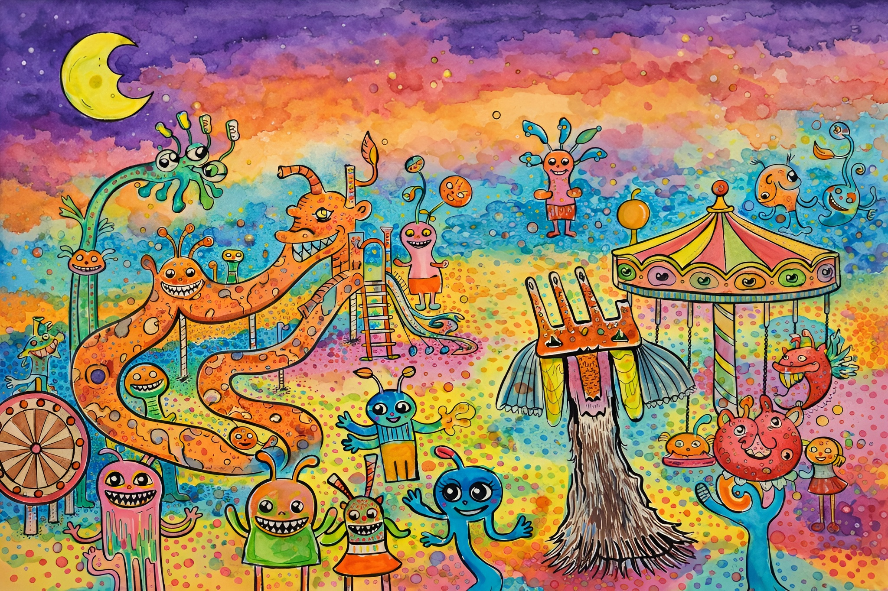

# Agent Memory Playground



Nine memory strategies. Two mischievous agents. One playground. No extra tokens to lose.

## Quick Start

- **Run:** `cp .env.example .env` (add your API keys), then `./start.sh`
- **Ports:** Backend 8000, frontend 3000
- **Manual:** Backend `python3 api.py`; frontend `cd frontend && npm install && npm run dev`

## Features

### Core Functionality

- **9 Memory Strategies**: Compare different approaches to managing conversation history
- **Dual Agent Comparison**: Run two agents side-by-side with different strategies
- **Real-time Performance Metrics**: Track retrieval time, generation time, and token usage
- **Interactive Dark UI**: Modern minimalist design with glassmorphism effects

---

### Memory Strategies

#### Basic

- **Sequential Memory**: Stores complete conversation history
- **Sliding Window**: Maintains only the N most recent turns

#### Intermediate

- **Summarization Memory**: Periodically summarizes old conversations
- **OS-Style Paging**: Simulates RAM/disk with intelligent paging

#### Advanced

- **RAG Memory**: Vector-based semantic search
- **Compression Memory**: Intelligent information compression
- **Graph Knowledge Memory**: Relationship-based knowledge graph

#### Hybrid

- **Hierarchical Memory**: Combines working memory + long-term storage
- **Memory-Augmented**: Sliding window + persistent memory tokens

## Keyboard Shortcuts

| Shortcut                   | Action                          |
| -------------------------- | ------------------------------- |
| `Cmd/Ctrl + Enter`         | Send message (to focused agent) |
| `Cmd/Ctrl + Shift + Enter` | Send message to both agents     |
| `Cmd/Ctrl + K`             | Clear agent memory              |
| `Cmd/Ctrl + /`             | Focus message input             |

## Tech Stack

### Backend

- **FastAPI** - Modern Python web framework
- **OpenAI API** - LLM and embeddings
- **FAISS** - Vector similarity search
- **NetworkX** - Graph-based memory
- **Tiktoken** - Token counting

### Key Endpoints

```
GET  /api/strategies              # List available strategies
POST /api/agent/create            # Create agent with strategy
POST /api/chat                    # Send message to agent
GET  /api/agent/{id}/stats        # Get memory statistics
POST /api/agent/{id}/clear        # Clear agent memory
DELETE /api/agent/{id}            # Delete agent
```

## Using the Playground

1. **Select agents and memory strategies**: Use the config panel to set the desired memory strategy and model for each agent (for example, Agent A: "Sequential Memory", Agent B: "Sliding Window").
2. **Compose and send messages**: Enter a message in the input box. Use **Cmd/Ctrl + Enter** to send to the focused agent, or **Cmd/Ctrl + Shift + Enter** to send to both agents at once.
3. **Observe agent responses**: Compare how each agent responds based on their configured memory strategies.
4. **Explore agent memory**: Use the "Clear agent memory" shortcut (**Cmd/Ctrl + K**) as needed, and switch between strategies to see how memory impacts responses.
5. **Monitor key metrics**: Track retrieval time, generation time, and token usage beneath each agent's chat to evaluate performance and efficiency of different strategies.
6. **Experiment and iterate**: Try out various strategies, models, and message types to see how the UI and agents behave in different scenarios.

## Agent Performance

Once you start prompting, the metrics area under each agent window will show:

| Metric              | Description                                                                                       |
| ------------------- | ------------------------------------------------------------------------------------------------- |
| **Retrieval time**  | Time to fetch context from memory (e.g. vector search for RAG, graph lookup) before the LLM runs. |
| **Generation time** | Time the LLM took to produce the reply.                                                           |
| **Token usage**     | Prompt and completion tokens so you can compare strategies by latency and token use.              |

###

---

###

**Built for devs allergic to misbehaving agents 🎡**
